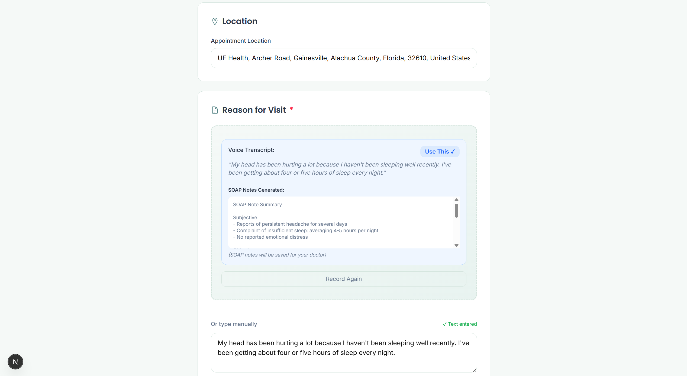
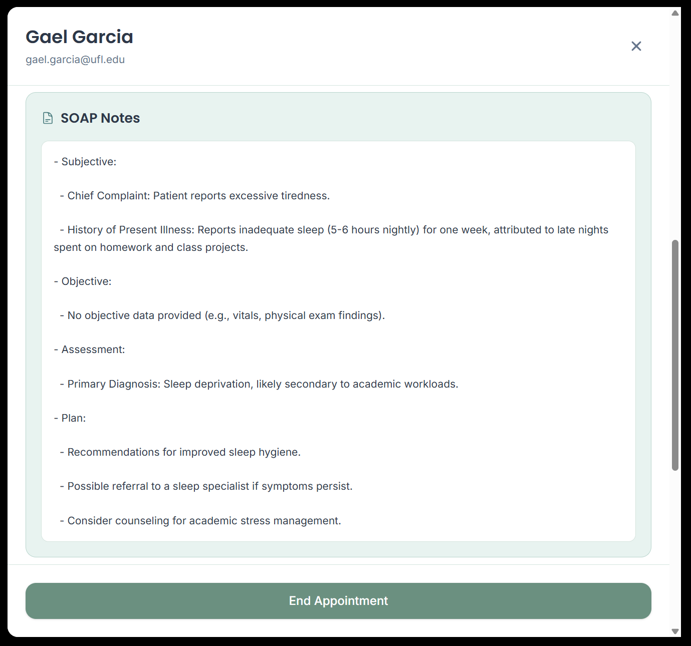
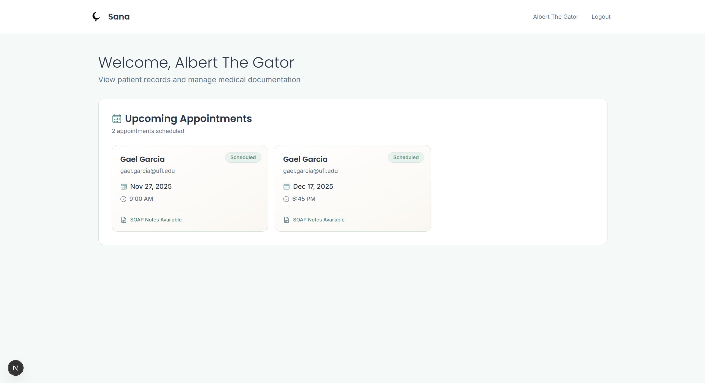
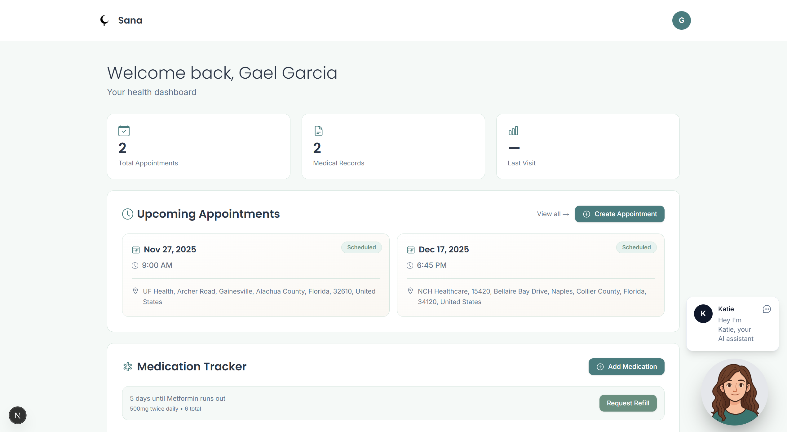
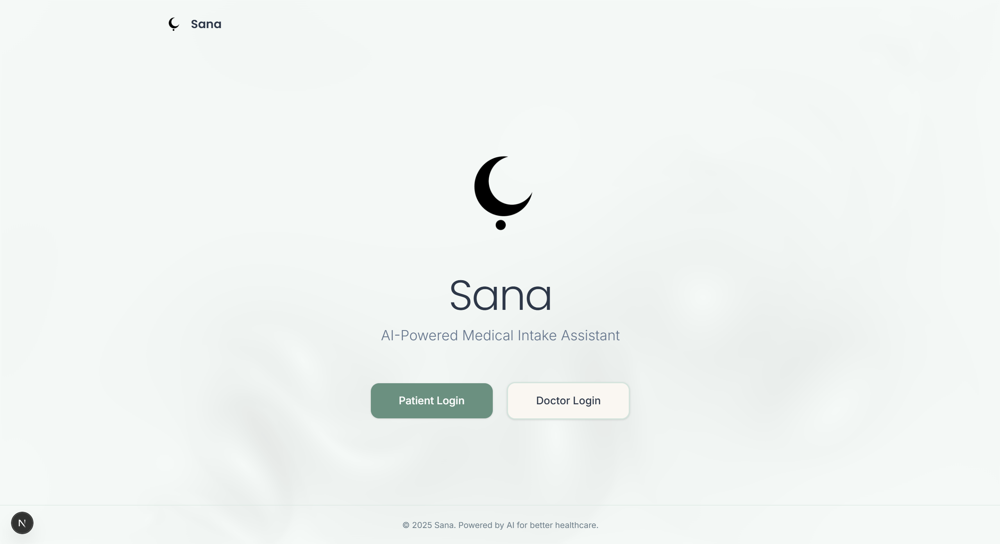
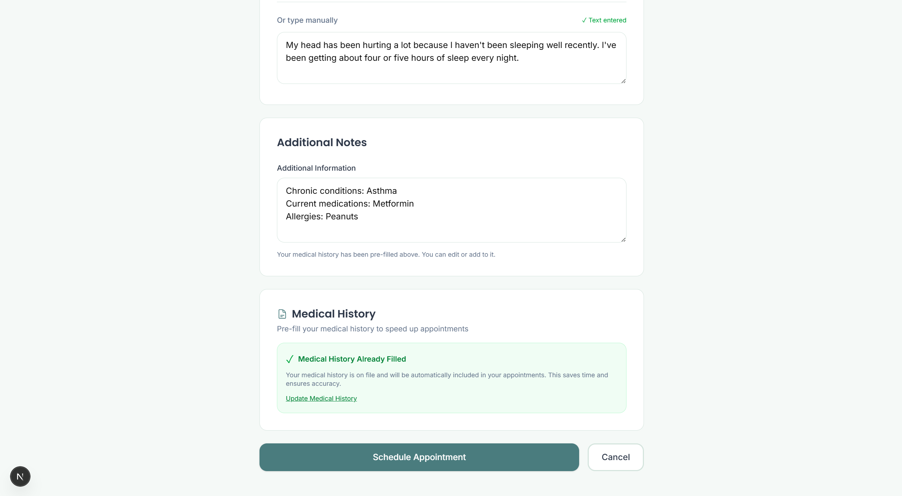
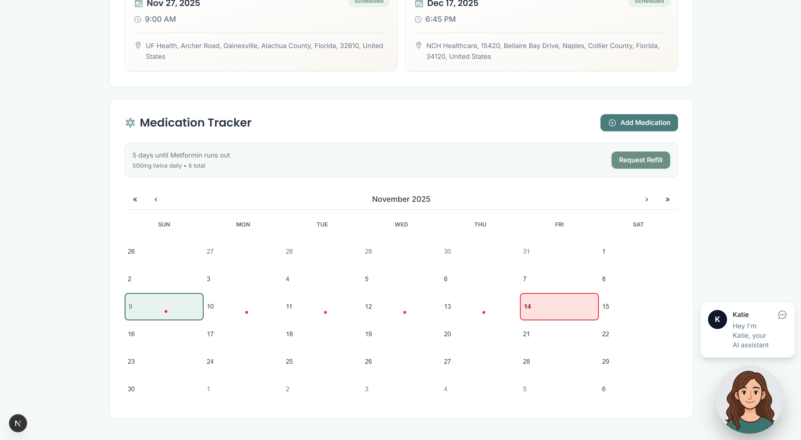
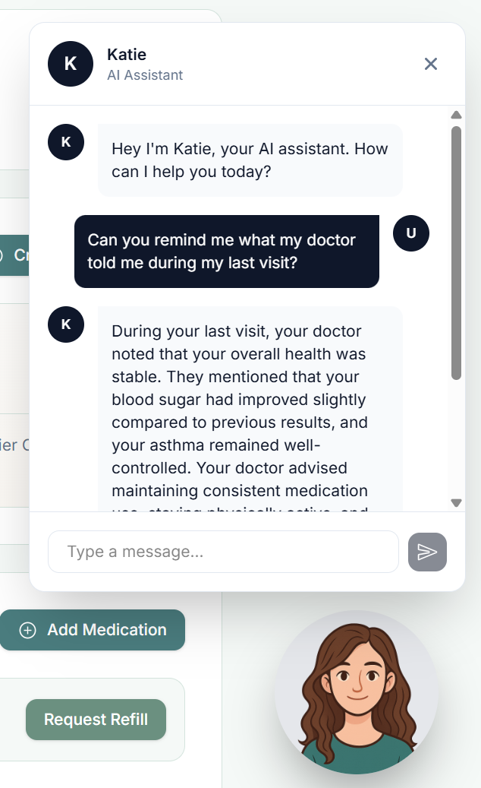

# Sana: AI-Powered Conversational Healthcare

<div align="center">


[](https://nextjs.org/)
[](https://reactjs.org/)
[](https://fastapi.tiangolo.com/)
[](https://www.typescriptlang.org/)
[](https://tailwindcss.com/)

**Transforming patient intake from stressful questionnaires to natural conversations.**

[Live Demo](#) • [Documentation](#) • [Quick Start](#quick-start)

</div>

---

## Problem Statement

In primary care settings, physicians spend **40%+ of their time** on administrative tasks, particularly patient intake and documentation. Traditional methods are:

- **Time-consuming**: Manual note-taking during consultations
- **Error-prone**: Incomplete or inaccurate documentation
- **Stressful**: Patients struggle to articulate symptoms under pressure
- **Inefficient**: Repetitive data entry across multiple systems

**Sana addresses these challenges** by transforming conversational patient intake into structured medical documentation using cutting-edge AI.

---

## Key Features

### Conversational Patient Intake
Patients describe symptoms naturally through speech, eliminating the need for stressful questionnaires and manual form-filling.



### Intelligent SOAP Note Generation
Converts free-form patient conversations into professional, structured SOAP (Subjective, Objective, Assessment, Plan) notes instantly.



### Comprehensive Dashboards

#### Physician Dashboard
Real-time patient summaries, emotional state indicators, and prioritized case management.



#### Patient Dashboard
Personal health tracking, medication reminders, and appointment management.



### Time Optimization Impact
- **>40% reduction** in administrative time per consultation
- **90% faster** documentation completion
- **Improved patient satisfaction** through natural conversations
- **Enhanced diagnostic accuracy** with emotion-aware insights

---

## Technology Stack

### Frontend
- **Framework:** Next.js 16 + React 19
- **Language:** TypeScript
- **Styling:** Tailwind CSS
- **3D Graphics:** Three.js + React Three Fiber
- **UI Components:** Material-UI + Custom Components
- **Real-time Features:** WebRTC for webcam/audio capture

### Backend
- **Framework:** FastAPI (Python 3.10+)
- **Server:** Uvicorn ASGI
- **API Design:** RESTful with automatic OpenAPI docs
- **Dependencies:** Transformers, PyTorch, MediaPipe, OpenAI Whisper

### AI/ML Models

| Component | Model | Purpose |
|-----------|--------|---------|
| **Speech Recognition** | OpenAI Whisper-small | Real-time speech-to-text transcription |
| **NLP Reasoning & SOAP** | Llama 3.1 | Medical note generation and clinical reasoning |
| **RAG Assistant** | Llama 3.1 | Conversational AI support for physicians |

### Infrastructure
- **Database:** PostgreSQL / Supabase
- **Monitoring:** Application performance and AI model metrics

---

## Application Screenshots

### Landing Page
Professional, welcoming interface that puts patients at ease.



### Pre-filled Patient History
Intelligent context gathering before consultations.



### Medication Tracker
Comprehensive medication management with AI-powered reminders.



### RAG AI Assistant
Contextual AI support for physicians during consultations.



---

## Quick Start

### Prerequisites
- Node.js 18+
- Python 3.10+
- PostgreSQL (optional, for data persistence)

### Installation

1. **Clone the repository**
```bash
git clone https://github.com/GG1627/Dream-Team-Engineering-Designathon.git
cd Dream-Team-Engineering-Designathon
```

2. **Setup Frontend**
```bash
cd frontend
npm install
npm run dev
```

3. **Setup Backend**
```bash
cd ../backend
python -m venv venv
source venv/bin/activate  # On Windows: venv\Scripts\activate
pip install -r requirements.txt
uvicorn main:app --reload
```

<div align="center">

**Built for better healthcare experiences**

</div>
